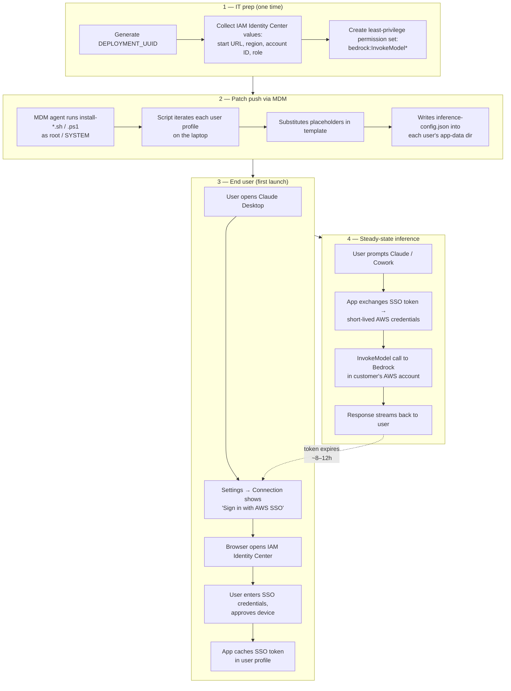

# Claude Desktop on Bedrock — IT deployment package (in-app SSO)

This package configures Claude Desktop (and Cowork mode, which runs inside Desktop) to send inference to Amazon Bedrock via IAM Identity Center. **Users do not need a terminal, the AWS CLI, or any technical knowledge** — after the patch lands, they open Claude, click **Sign in with AWS SSO**, complete the standard SSO browser flow, and they're done.

## What it ships

```
claude-desktop-deploy/
├── config/
│   └── claude-desktop-config.json    # Desktop inference config + embedded SSO fields
├── scripts/
│   ├── install-macos.sh              # run as root
│   ├── install-linux.sh              # run as root
│   ├── install-windows.ps1           # run as Administrator / SYSTEM
│   ├── verify.sh                     # run as the end user
│   └── uninstall.sh                  # macOS + Linux rollback
└── docs/README.md
```

## How it works

Claude Desktop has built-in AWS SSO support. When the four `inferenceBedrockSso*` fields are present in `inference-config.json`, the Settings → Connection panel shows a **Sign in with AWS SSO** button that drives the entire OAuth device-flow. Tokens cache automatically in the app's profile directory; the app refreshes them on its own. **No `~/.aws/config` or `~/.aws/credentials` is required**, and no AWS CLI install is required.

### End-to-end flow



The same diagram in plain English: IT preps once, pushes the patch via MDM, each user signs in once via the in-app SSO button, and from then on every prompt routes through the customer's Bedrock account using short-lived credentials. When the SSO session expires (8–12h), the app reprompts for sign-in.

## Pre-deployment — generate a deployment UUID

Each customer org should have its **own** `deploymentOrganizationUuid`. Don't reuse one between customers. Generate a fresh UUID once, before you build the payload, and reuse the same value across every laptop in that org's rollout — that way all installs report as belonging to the same deployment.

Generate one with whichever is convenient:

```bash
# macOS / Linux
uuidgen | tr '[:lower:]' '[:upper:]'
```

```powershell
# Windows
[guid]::NewGuid().ToString().ToUpper()
```

```python
# Python anywhere
python3 -c "import uuid; print(str(uuid.uuid4()).upper())"
```

The output looks like `2D933D0A-7084-4B30-A6A4-835D470E7E69`. Pass it to the installer via the `DEPLOYMENT_UUID` env var (see Option B below). If you don't pass one, the install scripts will mint a random UUID **per machine** — that works but means each laptop registers as its own deployment, making org-wide usage tracking harder.

## Pre-deployment — fill in IAM Identity Center values

The four SSO placeholders need real values from the customer's Identity Center setup. You have two ways to provide them:

**Option A — edit the JSON template directly** (`config/claude-desktop-config.json`):

```json
"inferenceBedrockSsoStartUrl":  "https://example.awsapps.com/start",
"inferenceBedrockSsoRegion":    "us-east-1",
"inferenceBedrockSsoAccountId": "123456789012",
"inferenceBedrockSsoRoleName":  "BedrockInference"
```

**Option B — pass as environment variables to the installer** (no JSON edit needed):

```bash
SSO_START_URL="https://example.awsapps.com/start" \
SSO_REGION="us-east-1" \
ACCOUNT_ID="123456789012" \
ROLE_NAME="BedrockInference" \
DEPLOYMENT_UUID="2D933D0A-7084-4B30-A6A4-835D470E7E69" \
sudo bash scripts/install-macos.sh
```

| Field | Where to find it |
|---|---|
| SSO start URL | IAM Identity Center → Settings → AWS access portal URL |
| SSO region | Region your Identity Center instance lives in |
| Account ID | The 12-digit AWS account hosting Bedrock |
| Role name | Permission set granting `bedrock:InvokeModel*` on that account |

The role's permission set must allow `bedrock:InvokeModel` and `bedrock:InvokeModelWithResponseStream` on the three Anthropic model IDs in `claude-desktop-config.json`.

## Deployment via MDM

### macOS — Jamf / Kandji / Munki
```bash
# postinstall script
SSO_START_URL="https://example.awsapps.com/start" \
SSO_REGION="us-east-1" \
ACCOUNT_ID="123456789012" \
ROLE_NAME="BedrockInference" \
DEPLOYMENT_UUID="2D933D0A-7084-4B30-A6A4-835D470E7E69" \
bash "$INSTALL_DIR/scripts/install-macos.sh"
```

### Windows — Intune / SCCM
Wrap as a Win32 app. Install command (run as SYSTEM):
```
powershell.exe -ExecutionPolicy Bypass -Command "$env:SSO_START_URL='https://example.awsapps.com/start'; $env:SSO_REGION='us-east-1'; $env:ACCOUNT_ID='123456789012'; $env:ROLE_NAME='BedrockInference'; $env:DEPLOYMENT_UUID='2D933D0A-7084-4B30-A6A4-835D470E7E69'; & .\scripts\install-windows.ps1"
```
Detection rule: `C:\Users\<any>\AppData\Roaming\Claude\inference-config.json` exists.

### Linux — Ansible
```yaml
- name: Deploy Claude Desktop Bedrock config
  hosts: workstations
  become: true
  environment:
    SSO_START_URL:   "https://example.awsapps.com/start"
    SSO_REGION:      "us-east-1"
    ACCOUNT_ID:      "123456789012"
    ROLE_NAME:       "BedrockInference"
    DEPLOYMENT_UUID: "2D933D0A-7084-4B30-A6A4-835D470E7E69"
  tasks:
    - copy: { src: claude-desktop-deploy/, dest: /opt/claude-desktop-deploy/, mode: '0755' }
    - command: bash /opt/claude-desktop-deploy/scripts/install-linux.sh
```

## Pilot rollout checklist

1. **Pre-flight one machine**: run installer → run `scripts/verify.sh` as the end user → confirm all four SSO fields are filled (no `{{...}}` placeholders left).
2. **Open Claude Desktop**: Settings → Connection should show Bedrock selected with SSO start URL populated. Click **Sign in with AWS SSO**, complete the browser flow, send a test message.
3. **Open Cowork mode** inside Desktop: confirm a simple prompt routes through Bedrock (CloudTrail in the AWS account will show `InvokeModel` calls from the user).
4. **Pilot 10–20 users** for 3–5 business days. Watch for SSO session expiry — Claude reprompts in-app when the cached token expires.
5. **Org-wide** once pilot is clean.

## End-user one-pager

> Your laptop has been configured to use Claude Desktop with the company's Bedrock account.
>
> **First-time setup (takes 30 seconds):**
> 1. Open Claude.
> 2. If prompted, click **Sign in with AWS SSO**.
> 3. A browser window opens — sign in with your usual SSO credentials and approve the request.
> 4. Return to Claude. You're done.
>
> When your SSO session expires (typically every 8–12 hours, set by IT), Claude will reprompt you — just click **Sign in with AWS SSO** again.

That's it. No terminal, no commands, no AWS CLI install.

## Rollback

Run `scripts/uninstall.sh` (macOS/Linux) as root, or on Windows delete `C:\Users\*\AppData\Roaming\Claude\inference-config.json`. SSO token caches in the app profile are left in place; they expire on their own.

## Security callouts

- **No credentials are baked into the package.** AWS access is obtained at runtime via the in-app SSO flow.
- **No `~/.aws/credentials` or `~/.aws/config` is created or modified.** Existing AWS configurations on the laptop are untouched. This avoids any conflict with developer workflows the user may already have.
- **Bedrock VPC endpoints**: if private connectivity is required, add `"inferenceBedrockBaseUrl"` to `claude-desktop-config.json` pointing at the VPCE DNS name.
- **Egress allowlists**: end-user laptops need outbound HTTPS to the SSO start URL host, the Identity Center OIDC endpoint for the SSO region, and the Bedrock runtime endpoint for the inference region.
- **Token storage**: SSO tokens cached by the app are scoped to the user profile and protected by OS-level file permissions. They are short-lived and auto-refreshed.

