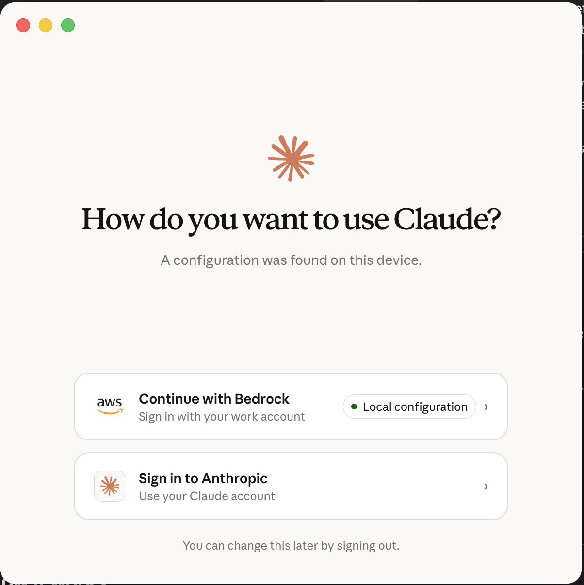
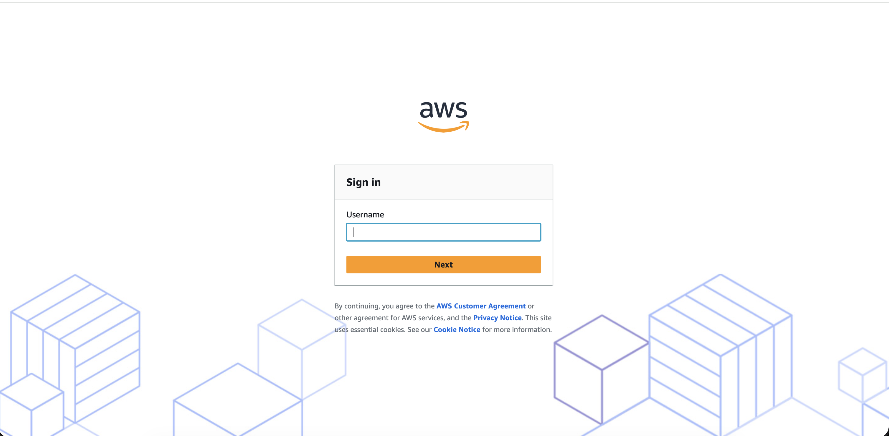
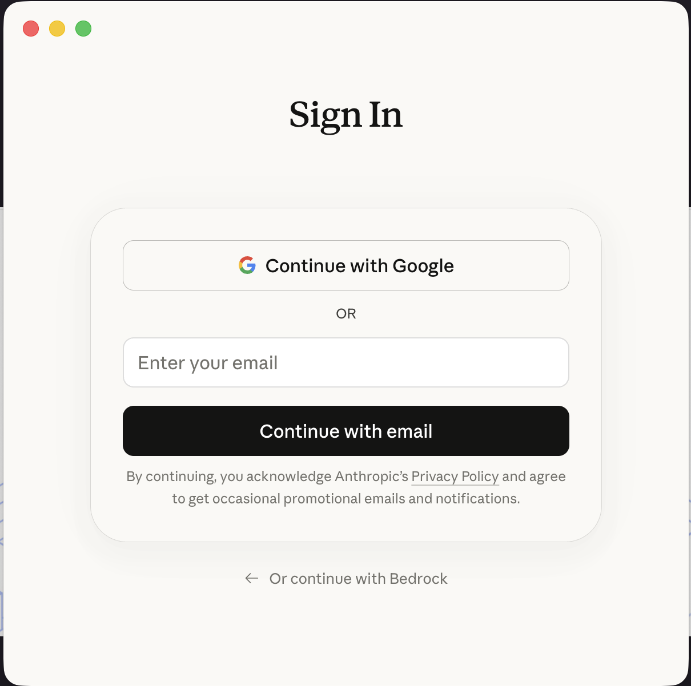

# Claude Desktop on Bedrock — IT deployment package (in-app SSO)

This package configures Claude Desktop (and Cowork mode, which runs inside Desktop) to send inference to Amazon Bedrock via IAM Identity Center. **Users do not need a terminal, the AWS CLI, or any technical knowledge** — after the patch lands, they open Claude, click **Continue with Bedrock** on the launch picker, complete the standard AWS SSO browser flow, and they're done.

> [!IMPORTANT]
> ## Caveats to share with your customer's IT and security teams
>
> 1. **Users will see a "Sign in to Anthropic" option alongside "Continue with Bedrock"** on the launch picker. This option signs them into their *personal* claude.ai account using direct Anthropic inference — **not** your customer's Bedrock account. For organizations with strict data-handling policies, this means a user could route work conversations to Anthropic instead of Bedrock by switching providers. **There is no documented config flag in this package to hide the Anthropic option.** If your customer needs it disabled, raise that requirement with their Anthropic account team.
>
> 2. **The provider switch requires sign out → sign in.** The app holds one active provider at a time. There is no in-app toggle that keeps both Bedrock and Anthropic active simultaneously. Switching providers interrupts any in-flight Cowork session.
>
> 3. **Conversation history is segregated by provider.** Bedrock-side conversations are governed by the customer's AWS data-retention controls; Anthropic-side conversations live in the user's personal claude.ai history. The two stores never merge.
>
> 4. **`skipDangerousModePermissionPrompt` is *not* set by this package** (Claude Desktop has no equivalent today). For Claude Code rollouts to the same laptops, that flag bypasses confirmation prompts for risky agent actions. If your customer ships Claude Code separately, treat that as a deliberate org-wide security posture decision.
>
> 5. **The on-disk filename varies by build.** Field testing on the "Cowork 3P" build of Claude Desktop showed the inference config landing at `~/Library/Application Support/Claude/config.json`, not `inference-config.json` as the install scripts currently target. Before customer rollout, confirm the filename matches the build the customer is on by setting up one machine via the GUI and inspecting that directory; update `scripts/install-*.{sh,ps1}` if needed.
>
> 6. **AWS account placement matters.** Do not host the Bedrock workload in a Control Tower **Security OU** account (Audit, Log Archive, security tooling). Use a dedicated workload account in a Workloads/Sandbox OU instead. SCPs on the Security OU will likely block Bedrock invocations and mixing end-user activity with SecOps audit accounts violates the OU isolation model.

## What it ships

```
claude-desktop-deploy/
├── README.md                         # this file
├── config/
│   └── claude-desktop-config.json    # Desktop inference config + embedded SSO fields
├── images/
│   ├── provider-picker.png           # "How do you want to use Claude?" screen
│   ├── aws-sso-signin.png            # AWS Identity Center sign-in page
│   └── anthropic-signin.png          # Anthropic account sign-in page
└── scripts/
    ├── install-macos.sh              # run as root
    ├── install-linux.sh              # run as root
    ├── install-windows.ps1           # run as Administrator / SYSTEM
    ├── verify.sh                     # run as the end user
    └── uninstall.sh                  # macOS + Linux rollback
```

## How it works

Claude Desktop has built-in AWS SSO support. When the four `inferenceBedrockSso*` fields are present in the inference config file (see caveat #5 above for filename), the launch picker shows **Continue with Bedrock** with a **Local configuration** badge. Clicking it drives the entire OAuth device-flow — the app opens AWS Identity Center in a browser, the user signs in with their company SSO credentials, and tokens cache automatically in the app's profile directory. The app refreshes them on its own. **No `~/.aws/config` or `~/.aws/credentials` is required**, and no AWS CLI install is required.

### End-to-end flow

```mermaid
%%{init: {'flowchart': {'nodeSpacing': 70, 'rankSpacing': 90, 'padding': 20}, 'themeVariables': {'fontSize': '18px'}}}%%
flowchart TD
    subgraph AWS["1 — AWS setup (one time, in customer account)"]
        Z1[Pick region with<br/>Bedrock + Anthropic models]
        Z2[Enable IAM Identity Center<br/>note start URL + region]
        Z3[Create IDC group<br/>e.g. claude-users]
        Z4[Create permission set<br/>BedrockInference with<br/>bedrock:InvokeModel*]
        Z5[Assign group + permission set<br/>to the Bedrock AWS account]
        Z6[Smoke-test sign-in via<br/>AWS access portal]
        Z1 --> Z2 --> Z3 --> Z4 --> Z5 --> Z6
    end

    subgraph Prep["2 — IT prep (one time)"]
        A1[Generate DEPLOYMENT_UUID]
        A2[Collect IAM Identity Center values:<br/>start URL, region, account ID, role]
        A1 --> A2
    end

    subgraph Push["3 — Patch push via MDM"]
        B1[MDM agent runs install-*.sh / .ps1<br/>as root / SYSTEM]
        B2[Script iterates each user profile<br/>on the laptop]
        B3[Substitutes placeholders in template]
        B4[Writes inference-config.json into<br/>each user's app-data dir]
        B1 --> B2 --> B3 --> B4
    end

    subgraph User["4 — End user (first launch)"]
        C1[User opens Claude Desktop]
        C2[Picker shows 'Continue with Bedrock'<br/>with Local configuration badge]
        C3[Browser opens IAM Identity Center]
        C4[User enters SSO credentials,<br/>approves device]
        C5[App caches SSO token<br/>in user profile]
        C1 --> C2 --> C3 --> C4 --> C5
    end

    subgraph Run["5 — Steady-state inference"]
        D1[User prompts Claude / Cowork]
        D2[App exchanges SSO token →<br/>short-lived AWS credentials]
        D3[InvokeModel call to Bedrock<br/>in customer's AWS account]
        D4[Response streams back to user]
        D1 --> D2 --> D3 --> D4
    end

    AWS --> Prep --> Push --> User --> Run
    D4 -.->|token expires<br/>~8–12h| C2
```



The same diagram in plain English: IT preps once, pushes the patch via MDM, each user signs in once via the in-app SSO button, and from then on every prompt routes through the customer's Bedrock account using short-lived credentials. When the SSO session expires (8–12h), the app reprompts for sign-in.

## AWS prerequisites (do these once, in the customer's AWS account)

The Desktop app uses IAM Identity Center for sign-in and Amazon Bedrock for inference. Before you push the laptop patch, the customer's AWS administrator needs to set up Identity Center, request Bedrock model access, define a least-privilege permission set, and assign it to the right group of users. Plan for 30–60 minutes the first time.

### 0. Confirm region

Pick a region where Bedrock supports the Anthropic Claude models you want (e.g. `us-east-1`, `us-west-2`). Use the same region for the inference config (`inferenceBedrockRegion`) and Identity Center if practical. Region availability: <https://docs.aws.amazon.com/bedrock/latest/userguide/models-regions.html>

### 1. Enable IAM Identity Center

If the customer hasn't already enabled IAM Identity Center (formerly AWS SSO), do it now in the AWS Organizations management account:

- AWS console → **IAM Identity Center** → **Enable**
- Choose an identity source: built-in directory, an existing AD/LDAP, or an external IdP (Okta, Entra ID, Google, etc.). For external IdPs, configure SAML/SCIM per their docs.
- Note the **AWS access portal URL** (e.g. `https://d-xxxxxxxxxx.awsapps.com/start`) and the **Identity Center region** — these become `SSO_START_URL` and `SSO_REGION`.

Docs: <https://docs.aws.amazon.com/singlesignon/latest/userguide/get-set-up-for-idc.html>

### 2. Create the IDC group for Claude users

In Identity Center, group the users who should get Claude access (e.g. `claude-users`):

- AWS console → **IAM Identity Center** → **Groups** → **Create group** → name it `claude-users` (or whatever your customer prefers).
- Add users to the group: **Users** tab → pick existing IDC users (or create them / sync from your IdP) → **Add to group**.

Docs: <https://docs.aws.amazon.com/singlesignon/latest/userguide/addgroups.html>

### 3. Create a least-privilege permission set

Don't reuse `AdministratorAccess` for end users — create a Bedrock-only permission set:

- AWS console → **IAM Identity Center** → **Permission sets** → **Create permission set** → **Custom permission set**.
- Name: `BedrockInference` (this becomes `ROLE_NAME` in the install script).
- Session duration: 8h is a good default; max is 12h. Longer = fewer reprompts for users.
- Inline policy:

  ```json
  {
    "Version": "2012-10-17",
    "Statement": [
      {
        "Sid": "InvokeAnthropicClaudeOnBedrock",
        "Effect": "Allow",
        "Action": [
          "bedrock:InvokeModel",
          "bedrock:InvokeModelWithResponseStream"
        ],
        "Resource": [
          "arn:aws:bedrock:*::foundation-model/anthropic.claude-opus-4-7*",
          "arn:aws:bedrock:*::foundation-model/anthropic.claude-sonnet-4-6*",
          "arn:aws:bedrock:*::foundation-model/anthropic.claude-haiku-4-5*",
          "arn:aws:bedrock:*:*:inference-profile/global.anthropic.claude-opus-4-7*",
          "arn:aws:bedrock:*:*:inference-profile/global.anthropic.claude-sonnet-4-6*",
          "arn:aws:bedrock:*:*:inference-profile/global.anthropic.claude-haiku-4-5*"
        ]
      }
    ]
  }
  ```

  The two `Resource` blocks cover both direct foundation-model ARNs and cross-region inference-profile ARNs (which is what `global.anthropic.*` model IDs resolve to). Tighten the `*` regions to a specific region if your customer wants stricter scoping.

Docs:
- Permission sets: <https://docs.aws.amazon.com/singlesignon/latest/userguide/permissionsetsconcept.html>
- Bedrock IAM actions / resources: <https://docs.aws.amazon.com/service-authorization/latest/reference/list_amazonbedrock.html>
- Inference profiles (cross-region routing): <https://docs.aws.amazon.com/bedrock/latest/userguide/cross-region-inference.html>

### 4. Assign the group to the AWS account with that permission set

This is the step that wires everything together:

- AWS console → **IAM Identity Center** → **AWS accounts** → select the account that has Bedrock enabled (the one whose 12-digit ID becomes `ACCOUNT_ID`).
- Click **Assign users or groups** → select the `claude-users` group from step 3 → **Next**.
- Select the `BedrockInference` permission set from step 4 → **Next** → **Submit**.

Identity Center will provision an IAM role in that account behind the scenes (named `AWSReservedSSO_BedrockInference_<hash>`); end users never interact with this directly.

Docs: <https://docs.aws.amazon.com/singlesignon/latest/userguide/useraccess.html>

### 5. Smoke-test from one account

Before pushing to laptops, validate the chain works:

- Open the AWS access portal URL in a browser → sign in as a test user who is in `claude-users` → confirm the target account appears with `BedrockInference` listed → click into it → it should land on the AWS console.
- Optional CLI test (any developer machine with AWS CLI v2):
  ```bash
  aws sso login --profile test
  aws bedrock-runtime invoke-model \
    --model-id global.anthropic.claude-haiku-4-5-20251001-v1:0 \
    --body '{"anthropic_version":"bedrock-2023-05-31","max_tokens":10,"messages":[{"role":"user","content":"hi"}]}' \
    --content-type application/json --profile test /tmp/out.json && cat /tmp/out.json
  ```
  A JSON response means the permission set, model access, and region are all correctly wired.

### Values you now have for the patch

| Patch variable | Source |
|---|---|
| `SSO_START_URL`   | Step 1 — AWS access portal URL |
| `SSO_REGION`      | Step 1 — Identity Center home region |
| `ACCOUNT_ID`      | Step 4 — the 12-digit AWS account hosting Bedrock |
| `ROLE_NAME`       | Step 3 — name of the permission set (e.g. `BedrockInference`) |
| `DEPLOYMENT_UUID` | Generated below — your unique per-customer ID |

### Quick AWS-side reference links

- IAM Identity Center user guide: <https://docs.aws.amazon.com/singlesignon/latest/userguide/what-is.html>
- Amazon Bedrock user guide: <https://docs.aws.amazon.com/bedrock/latest/userguide/what-is-bedrock.html>
- Bedrock pricing (so the customer knows what to budget): <https://aws.amazon.com/bedrock/pricing/>
- Bedrock CloudTrail / monitoring: <https://docs.aws.amazon.com/bedrock/latest/userguide/logging-using-cloudtrail.html>

---

## Pre-deployment — generate a deployment UUID

Each customer org should have its **own** `deploymentOrganizationUuid`. Don't reuse one between customers. Generate a fresh UUID once, before you build the payload, and reuse the same value across every laptop in that org's rollout — that way all installs report as belonging to the same deployment.

Generate one with whichever is convenient:

```bash
# macOS / Linux
uuidgen | tr '[:lower:]' '[:upper:]'
```

```powershell
# Windows
[guid]::NewGuid().ToString().ToUpper()
```

```python
# Python anywhere
python3 -c "import uuid; print(str(uuid.uuid4()).upper())"
```

The output looks like `2D933D0A-7084-4B30-A6A4-835D470E7E69`. Pass it to the installer via the `DEPLOYMENT_UUID` env var (see Option B below). If you don't pass one, the install scripts will mint a random UUID **per machine** — that works but means each laptop registers as its own deployment, making org-wide usage tracking harder.

## Pre-deployment — fill in IAM Identity Center values

The four SSO placeholders need real values from the customer's Identity Center setup. You have two ways to provide them:

**Option A — edit the JSON template directly** (`config/claude-desktop-config.json`):

```json
"inferenceBedrockSsoStartUrl":  "https://example.awsapps.com/start",
"inferenceBedrockSsoRegion":    "us-east-1",
"inferenceBedrockSsoAccountId": "123456789012",
"inferenceBedrockSsoRoleName":  "BedrockInference"
```

**Option B — pass as environment variables to the installer** (no JSON edit needed):

```bash
SSO_START_URL="https://example.awsapps.com/start" \
SSO_REGION="us-east-1" \
ACCOUNT_ID="123456789012" \
ROLE_NAME="BedrockInference" \
DEPLOYMENT_UUID="2D933D0A-7084-4B30-A6A4-835D470E7E69" \
sudo bash scripts/install-macos.sh
```

| Field | Where to find it |
|---|---|
| SSO start URL | IAM Identity Center → Settings → AWS access portal URL |
| SSO region | Region your Identity Center instance lives in |
| Account ID | The 12-digit AWS account hosting Bedrock |
| Role name | Permission set granting `bedrock:InvokeModel*` on that account |

The role's permission set must allow `bedrock:InvokeModel` and `bedrock:InvokeModelWithResponseStream` on the three Anthropic model IDs in `claude-desktop-config.json`.

## Deployment via MDM

### macOS — Jamf / Kandji / Munki
```bash
# postinstall script
SSO_START_URL="https://example.awsapps.com/start" \
SSO_REGION="us-east-1" \
ACCOUNT_ID="123456789012" \
ROLE_NAME="BedrockInference" \
DEPLOYMENT_UUID="2D933D0A-7084-4B30-A6A4-835D470E7E69" \
bash "$INSTALL_DIR/scripts/install-macos.sh"
```

### Windows — Intune / SCCM
Wrap as a Win32 app. Install command (run as SYSTEM):
```
powershell.exe -ExecutionPolicy Bypass -Command "$env:SSO_START_URL='https://example.awsapps.com/start'; $env:SSO_REGION='us-east-1'; $env:ACCOUNT_ID='123456789012'; $env:ROLE_NAME='BedrockInference'; $env:DEPLOYMENT_UUID='2D933D0A-7084-4B30-A6A4-835D470E7E69'; & .\scripts\install-windows.ps1"
```
Detection rule: `C:\Users\<any>\AppData\Roaming\Claude\inference-config.json` exists.

### Linux — Ansible
```yaml
- name: Deploy Claude Desktop Bedrock config
  hosts: workstations
  become: true
  environment:
    SSO_START_URL:   "https://example.awsapps.com/start"
    SSO_REGION:      "us-east-1"
    ACCOUNT_ID:      "123456789012"
    ROLE_NAME:       "BedrockInference"
    DEPLOYMENT_UUID: "2D933D0A-7084-4B30-A6A4-835D470E7E69"
  tasks:
    - copy: { src: claude-desktop-deploy/, dest: /opt/claude-desktop-deploy/, mode: '0755' }
    - command: bash /opt/claude-desktop-deploy/scripts/install-linux.sh
```

## Pilot rollout checklist

1. **Pre-flight one machine**: run installer → run `scripts/verify.sh` as the end user → confirm all four SSO fields are filled (no `{{...}}` placeholders left).
2. **Open Claude Desktop**: launch picker should show **Continue with Bedrock** with a "Local configuration" badge. Click it, complete the AWS SSO browser flow, send a test message.
3. **Open Cowork mode** inside Desktop: confirm a simple prompt routes through Bedrock (CloudTrail in the AWS account will show `InvokeModel` calls from the user).
4. **Pilot 10–20 users** for 3–5 business days. Watch for SSO session expiry — Claude reprompts in-app when the cached token expires.
5. **Org-wide** once pilot is clean.

## End-user one-pager

> Your laptop has been configured to use Claude Desktop with the company's Bedrock account.
>
> **First-time setup (takes 30 seconds):**
> 1. Open Claude.
> 2. On the **"How do you want to use Claude?"** screen, click **Continue with Bedrock** (the option labeled **Local configuration** — that's the patch IT just pushed).
>
>    
>
> 3. The app opens the AWS sign-in page. Sign in with your usual company SSO credentials and approve the request.
>
>    
>
> 4. Return to Claude. You're done — Cowork and Code are now routed through the company's Bedrock account.
>
> When your SSO session expires (typically every 8–12 hours, set by IT), Claude reprompts you — just click **Continue with Bedrock** again.

### Switching between Bedrock (work) and Anthropic chat (personal)

The app's sign-in screen shows two options side-by-side: **Continue with Bedrock** (your company's account) and **Sign in to Anthropic** (your personal Claude account on claude.ai). You can switch between them at any time:

1. **File menu → Sign out** (or click your profile icon → Sign out).
2. The "How do you want to use Claude?" picker reappears.
3. Pick the other option and sign in.

If you pick **Sign in to Anthropic**, the app shows the standard Claude account sign-in (Continue with Google or email). There's also an "Or continue with Bedrock" link if you change your mind.



The two sides use unrelated identities — Bedrock uses the company's AWS SSO, Anthropic uses the user's personal claude.ai account. **For company work, stay on Bedrock.** Use the Anthropic side only for personal use, where company policy permits. (See caveats #1–3 at the top of this README for the underlying constraints.)

### IT requirements to enable this picker

The picker appears automatically once a config file is present in `~/Library/Application Support/Claude/` (macOS) or the equivalent on Windows/Linux — i.e. once the patch in this package has run. **No additional configuration is needed** to expose the Anthropic option; it's a built-in feature of the desktop app, available to any user with a personal Claude account. (Compliance implications: see caveat #1 at the top of this README.)

## Disabling Claude Cowork and Chat at the organization level

If your customer's security or compliance posture requires disabling Claude Cowork or Chat capabilities entirely (rather than relying on users to stay on Bedrock), administrators can control this at the organization level.

### Disabling Cowork (Claude Desktop)

Cowork is enabled by default when the research preview launches, but organization owners can disable it for all users:

1. Log in to the Team or Enterprise organization as an **Owner** or **Primary Owner**.
2. Navigate to **Organization settings → Capabilities**.
3. Locate the **Cowork** toggle.
4. Toggle **off** to disable Cowork for all users in the organization.

> **Note:** This is an organization-wide setting. Granular controls by user or role are not currently available on Team plans. On Enterprise plans, admins can use groups and custom roles to selectively enable Cowork for specific users or teams.

**Plugins** are controlled by the same admin toggle — there is no separate setting to manage plugin access within Cowork.

**Important compliance limitation:** Cowork activity is **not** captured in Audit Logs, Compliance API, or Data Exports. If your customer requires audit trails for compliance purposes, do not enable Cowork for regulated workloads. Conversation history is stored locally on users' computers and cannot be centrally managed or exported by admins.

For monitoring, Team and Enterprise owners can stream Cowork events to SIEM and observability tools through **OpenTelemetry** (tool calls, file access, human approval decisions), though this does not replace audit logging for compliance purposes.

### Disabling web search

Team or Enterprise plan owners can turn off **web search** for Cowork and Chat in **Organization settings → Capabilities**. Note that network egress permissions do not apply to the web fetch/search tools or MCPs — web search must be disabled separately via this toggle.

### Network access controls

Cowork respects the organization's network egress permissions configured in **Organization settings → Capabilities** under **Code execution**. However, network settings are applied only when a new Cowork session is created — changes made while a conversation is active will not take effect until the user starts a new conversation.

### Disabling Claude Code features (if also deployed)

If your customer also deploys Claude Code alongside Claude Desktop, administrators can enforce organization-wide policy through **managed settings**. Claude Code looks for managed settings in this priority order:

| Mechanism | Delivery | Priority |
|---|---|---|
| Server-managed | Claude.ai admin console | Highest |
| plist / registry | macOS: `com.anthropic.claudecode` plist; Windows: `HKLM\SOFTWARE\Policies\ClaudeCode` | High |
| File-based | macOS: `/Library/Application Support/ClaudeCode/managed-settings.json`; Linux/WSL: `/etc/claude-code/managed-settings.json`; Windows: `C:\Program Files\ClaudeCode\managed-settings.json` | Medium |

Key settings for restricting Claude Code capabilities:

```json
{
  "permissions": {
    "deny": ["WebFetch", "Bash(curl *)", "Read(./.env)"]
  },
  "disableAgentView": true,
  "sandbox": {
    "enabled": true,
    "network": {
      "allowedDomains": ["github.com", "*.npmjs.org"]
    }
  }
}
```

Managed settings **cannot be overridden** by user or project settings. Array settings like `permissions.allow` and `permissions.deny` merge entries from all sources, so developers can extend managed lists but not remove from them.

### References

- [Set up Claude Code for your organization](https://code.claude.com/docs/en/admin-setup) — decision map for administrators covering API providers, managed settings, policy enforcement, and data handling.
- [Claude Code settings](https://code.claude.com/docs/en/settings) — full reference for every setting key, file location, and precedence rule.

---

## Rollback

Run `scripts/uninstall.sh` (macOS/Linux) as root, or on Windows delete `C:\Users\*\AppData\Roaming\Claude\inference-config.json`. SSO token caches in the app profile are left in place; they expire on their own.

## Security callouts

- **No credentials are baked into the package.** AWS access is obtained at runtime via the in-app SSO flow.
- **No `~/.aws/credentials` or `~/.aws/config` is created or modified.** Existing AWS configurations on the laptop are untouched. This avoids any conflict with developer workflows the user may already have.
- **Bedrock VPC endpoints**: if private connectivity is required, add `"inferenceBedrockBaseUrl"` to `claude-desktop-config.json` pointing at the VPCE DNS name.
- **Egress allowlists**: end-user laptops need outbound HTTPS to the SSO start URL host, the Identity Center OIDC endpoint for the SSO region, and the Bedrock runtime endpoint for the inference region.
- **Token storage**: SSO tokens cached by the app are scoped to the user profile and protected by OS-level file permissions. They are short-lived and auto-refreshed.

